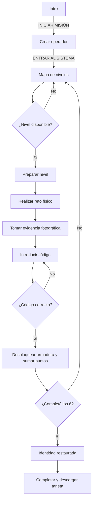

# Flujos de la Aplicación

## Flujo general



## Pantallas y estados

| Pantalla | ID | Entrada | Salida |
|---|---|---|---|
| Introducción | `intro` | Carga inicial | `pAvatar` al iniciar |
| Crear operador | `pAvatar` | Nombre, estilo y semilla de avatar | `pMapa` |
| Mapa | `pMapa` | Niveles y progreso | `pNivel` o `final` |
| Nivel | `pNivel` | Reto, foto y código | Mapa, modal de revelación o reintento |
| Final | `final` | Reflexiones personales | Descarga PNG o nueva misión |

La navegación se realiza con `verPantalla(id)`, que activa una sola pantalla mediante la clase `.on`. No existe router ni URL por pantalla.

## Inicio y creación del operador

1. La aplicación monta los medidores ADN, genera opciones de avatar y muestra `intro`.
2. `INICIAR MISIÓN` activa el contexto de audio y muestra `pAvatar`.
3. El participante escribe un nombre de hasta 18 caracteres.
4. Puede elegir uno de cuatro estilos y una semilla de avatar entre ocho opciones.
5. `ENTRAR AL SISTEMA` inicia la música, muestra el mapa y reproduce `VOCES.intro`.

El avatar se obtiene desde DiceBear. Si la imagen falla, la interfaz muestra la inicial del nombre.

## Mapa y desbloqueo progresivo

El estado de cada nivel es:

| Estado | Condición | Interacción |
|---|---|---|
| `bloq` | El nivel anterior no está completado | Botón deshabilitado |
| `libre` | Es el primer nivel o el anterior está completado | Abre el nivel |
| `hecho` | El código fue validado | Permite revisar el sector, sin repetirlo |

Al completar un nivel se actualizan:

- `hecho: true` en el elemento correspondiente de `nv`.
- Puntos base (`100`) más bonificación proporcional al tiempo restante.
- Medidor ADN.
- Pieza de armadura del avatar.
- Evidencia fotográfica mostrada en el mapa.

## Flujo interno de un nivel

```mermaid
sequenceDiagram
  participant U as Usuario
  participant UI as Interfaz
  participant V as Voz de Leo
  participant T as Temporizador

  U->>UI: Selecciona nivel libre
  UI->>UI: Carga brief, reto, tarjetas y materiales
  UI->>T: Inicia 300 segundos
  UI->>V: Reproduce voz n1...n6
  U->>UI: Realiza el reto físico
  U->>UI: Selecciona una fotografía
  UI->>UI: Comprime la imagen a JPEG
  U->>UI: Introduce código y pulsa Hackear
  alt No hay fotografía
    UI-->>U: Falta la evidencia del reto
  else Código incorrecto
    UI->>V: Reproduce mal-1 o mal-2
    UI-->>U: ACCESS DENIED; permite reintentar
  else Código correcto
    T->>UI: Detiene el temporizador
    UI->>V: Reproduce bien-1 o bien-2
    UI-->>U: Muestra pieza, verso, declaración y puntos
  end
```

### Reglas del temporizador

- Cada nivel inicia con `SEGUNDOS = 300`.
- Al llegar a cero se detiene el reloj y se puede continuar sin bonificación.
- El participante puede volver al mapa; el reloj se detiene.
- Al abrir de nuevo un nivel pendiente, el reloj vuelve a iniciar desde cinco minutos.
- Un nivel completado no muestra el reloj ni permite volver a validarlo.

## Error, pista y evidencia

### Código incorrecto

Se muestra un mensaje de error, se reproduce un mensaje `mal-*`, se aplica una animación al campo y el participante puede corregirlo. El intento no reinicia el nivel ni resta puntos.

### Pista

`Pista` reproduce la voz asociada (`p1` a `p6`) y muestra el aviso “escucha la pista de Leo”. No modifica la puntuación.

### Evidencia

El botón de foto abre un `input type="file"` con captura de cámara en dispositivos compatibles. La imagen se reduce a un máximo de 900 px por lado y se guarda como `data:` URL en memoria. Si no hay foto, el código nunca se valida.

## Revelación y final

1. El nivel correcto abre `#revelar`.
2. El modal muestra porcentaje restaurado, pieza de armadura, versículo, declaración y puntos ganados.
3. `CONTINUAR` devuelve al mapa y equipa la pieza visualmente.
4. Cuando los seis niveles están completos, el mapa habilita “Identidad desbloqueada”.
5. La pantalla final reproduce `gana`, carga opcionalmente `final/jesus.png` y presenta la tarjeta.
6. La tarjeta permite completar tres campos personales y descargar `mi-identidad-adn.png` mediante Canvas.

## Audio

```mermaid
flowchart LR
  A[hablar(clave)] --> B{¿Existe voces/clave.mp3?}
  B -->|Sí| C[Reproducir MP3]
  B -->|No o error| D[Speech Synthesis es-ES]
  C --> E[Leo hablando]
  D --> E
  E --> F[Música baja al 28%]
  F --> G[Termina voz]
  G --> H[Música recupera volumen]
```

La música busca `canciones/revolution.mp3`, `revolution.mp3`, `canciones/principal.mp3`, `principal.mp3`, `canciones/1.mp3` y `1.mp3`. Si no encuentra un archivo, la aplicación continúa sin música.

### Controles independientes

| Control | Elemento | Afecta | No afecta |
|---|---|---|---|
| Música MP3 | `#volSlider` | `canciones/*.mp3` y el fallback `revolution.mp3` | Voces y efectos |
| Voces de Leo | `#vozSlider` | `voces/*.mp3` y `Speech Synthesis` | Música y efectos |
| Sonido | `.btnSonido` | Efectos sintetizados de botones, errores y victoria | Música y voces |

El volumen de música se reduce automáticamente cuando Leo habla, pero vuelve al nivel elegido al terminar. Esta atenuación no cambia el volumen de voces.

En la voz sintetizada, el navegador aplica el nivel configurado al comenzar cada locución; un cambio durante una locución se refleja en la siguiente. En los archivos MP3 de voz, el cambio puede aplicarse mientras se reproducen.

## Nueva misión

`NUEVA MISIÓN` detiene reloj y música, reinicia los seis niveles, elimina las fotos, reinicia los puntos y vuelve al mapa. Conserva el avatar actual hasta que el participante lo cambie al iniciar otra sesión de avatar.

## Criterios de aceptación

- El usuario no puede saltar un nivel bloqueado.
- Cada nivel requiere foto y código correcto.
- Un código válido tolera diferencias de mayúsculas, tildes, espacios y puntuación.
- Completar un nivel desbloquea exactamente una pieza.
- Completar los seis niveles muestra la pantalla final.
- La experiencia sigue siendo utilizable sin música, voces MP3, imagen final o conexión a DiceBear.
